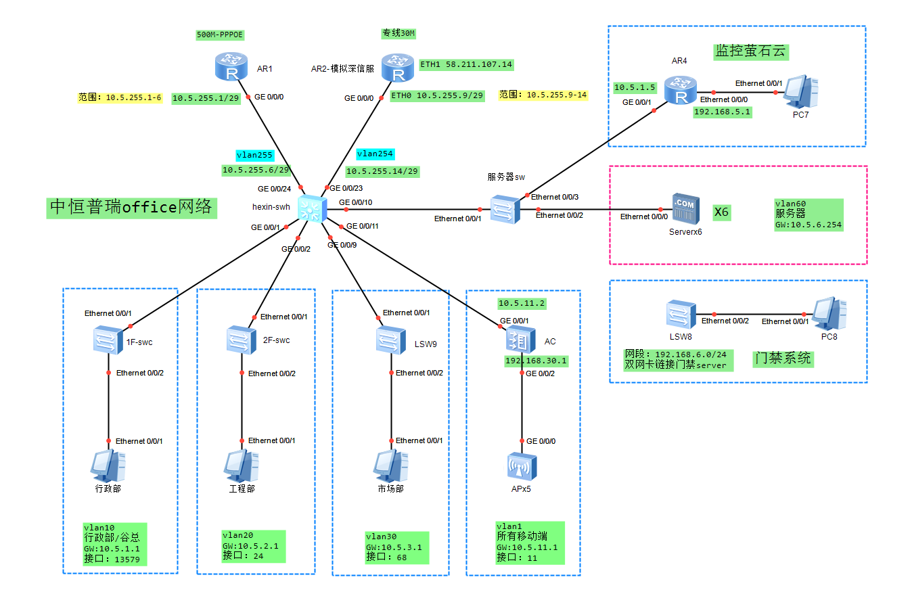
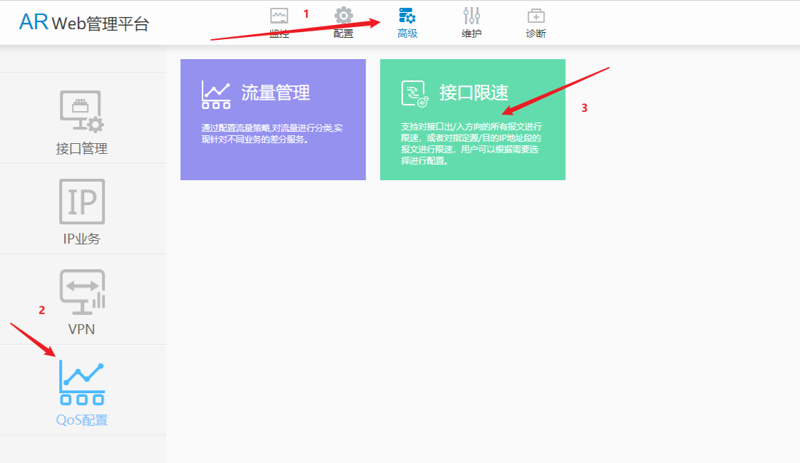
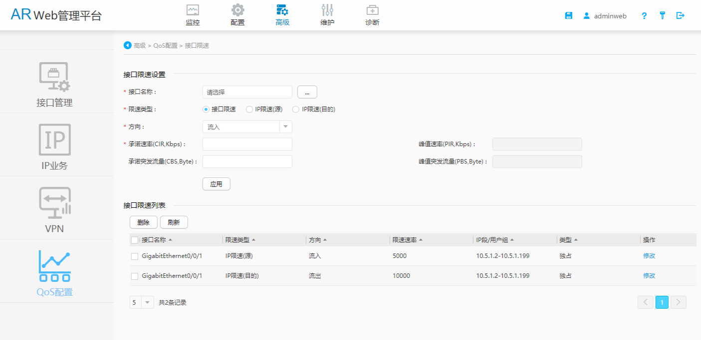

# 集团公司VPN项目（正在进行）


## 一、项目设计(拓扑图)




深信服是vlan254，IP段是254

## 二、路由器的配置

路由器型号：华为AR6120

### 2.0 开启web界面

### 2.1 PPPOE配置

一般每个设备都不太一样，所以建议在图形界面下配置。命令配置未必会一次性成功

```
interface Dialer1
 link-protocol ppp
 ppp chap user 051252297039
 ppp chap password cipher %^%#L1G!,5f=3ICz:9-n)t>=1Nh}EjeC_F;p;<ZLG}C;%^%#
 ppp pap local-user 051252297039 password cipher %^%##>4\PA+yGTezE1J<H2^X^K#_@i)&^67Z|JOXG|9T%^%#
 ppp ipcp dns admit-any
 ppp ipcp dns request
 mtu 1500
 tcp adjust-mss 1200
 ip address ppp-negotiate
 dialer user arweb
 dialer bundle 1
 dialer-group 1
 nat server protocol tcp global interface Dialer 1 6006 inside 10.5.6.251 6006
 nat server protocol tcp global interface Dialer 1 6007 inside 10.5.6.251 6007
 nat server protocol tcp global interface Dialer 1 6008 inside 10.5.6.251 6008
 nat server protocol tcp global interface Dialer 1 6009 inside 10.5.6.251 6009
 nat server protocol tcp global interface Dialer 1 6010 inside 10.5.6.251 6010
 nat server protocol tcp global interface Dialer 1 6011 inside 10.5.6.251 6011
 nat server protocol tcp global interface Dialer 1 6012 inside 10.5.6.251 6012
 nat server protocol tcp global current-interface 6668 inside 10.5.6.249 6668
 nat server protocol tcp global current-interface 6669 inside 10.5.1.201 6666
 nat server protocol tcp global current-interface 6667 inside 10.5.6.251 6666
 nat outbound 2999                        
 ddns apply policy 1111 fqdn f3322.net     #支持花生壳

```

### 2.2 NAT的配置

```
[500Mdaikuan]acl number 2999
[500Mdaikuan-acl-basic-GigabitEthernet0/0/8]dis th
[V300R019C10SPC300]
#
acl name GigabitEthernet0/0/8 2999  
 rule 5 permit 
#
return
[500Mdaikuan-acl-basic-GigabitEthernet0/0/8]

```

### 2.3端口映射

```
## pppoe线路的NAT

interface Dialer1

#端口映射，门禁server
nat server protocol tcp global interface Dialer 1 6666 inside 10.5.6.250 6666

#ftpserver,6006-6012
 nat server protocol tcp global interface Dialer 1 6006 inside 10.5.6.251 6006
 nat server protocol tcp global interface Dialer 1 6007 inside 10.5.6.251 6007
 nat server protocol tcp global interface Dialer 1 6008 inside 10.5.6.251 6008
 nat server protocol tcp global interface Dialer 1 6009 inside 10.5.6.251 6009
 nat server protocol tcp global interface Dialer 1 6010 inside 10.5.6.251 6010
 nat server protocol tcp global interface Dialer 1 6011 inside 10.5.6.251 6011
 nat server protocol tcp global interface Dialer 1 6012 inside 10.5.6.251 6012

#YUANCHENG
 nat server protocol tcp global current-interface 6668 inside 10.5.6.249 6668
 nat server protocol tcp global current-interface 6669 inside 10.5.1.201 6666
```

端口映射实操全记录

```
[500Mdaikuan]int Dialer 1
[500Mdaikuan-Dialer1]dis th
[V300R019C10SPC300]
#
interface Dialer1
 link-protocol ppp
 ppp chap user 051252297039
 ppp chap password cipher %^%#L1G!,5f=3ICz:9-n)t>=1Nh}EjeC_F;p;<ZLG}C;%^%#
 ppp pap local-user 051252297039 password cipher %^%##>4\PA+yGTezE1J<H2^X^K#_@i)&^67Z|JOXG|9T%^%#
 ppp ipcp dns admit-any
 ppp ipcp dns request
 mtu 1500
 tcp adjust-mss 1200
 ip address ppp-negotiate
 dialer user arweb
 dialer bundle 1
 dialer-group 1
 nat outbound 2999 
#
return
[500Mdaikuan-Dialer1]na 
[500Mdaikuan-Dialer1]nat ?
  outbound  Specify net address translation
  server    Specify NAT server
  static    Specify static NAT
[500Mdaikuan-Dialer1]nat ser
[500Mdaikuan-Dialer1]nat server p
[500Mdaikuan-Dialer1]nat server protocol tcp ?
  global  Specify global information of NAT
[500Mdaikuan-Dialer1]nat server protocol tcp g
[500Mdaikuan-Dialer1]nat server protocol tcp global ?
  X.X.X.X            Global IP address of NAT
  current-interface  Address of current interface
  interface          Specify the interface
[500Mdaikuan-Dialer1]nat server protocol tcp global in
[500Mdaikuan-Dialer1]nat server protocol tcp global interface ?
  Dialer            Dialer interface
  GigabitEthernet   GigabitEthernet interface
  LoopBack          LoopBack interface
  Vlanif            Vlan interface
  XGigabitEthernet  XGigabitEthernet interface
[500Mdaikuan-Dialer1]nat server protocol tcp global interface D
[500Mdaikuan-Dialer1]nat server protocol tcp global interface Dialer ?
  <1-1>  Dialer interface number
[500Mdaikuan-Dialer1]nat server protocol tcp global interface Dialer 1 ?
  <0-65535>  Global port of NAT
  CHARgen    Character generator (19)
  any        Any protocol (0)
  bgp        Border Gateway Protocol (179)
  cmd        Remote commands (rcmd, 514)
  daytime    Daytime (13)
  discard    Discard (9)
  domain     Domain Name Service (53)
  echo       Echo (7)
  exec       Exec (rsh, 512)
  finger     Finger (79)
  ftp        File Transfer Protocol (21)
  gopher     Gopher (70)
  hostname   NIC hostname server (101)
  inside     Specify inside information of NAT
  irc        Internet Relay Chat (194)
  klogin     Kerberos login (543)
  kshell     Kerberos shell (544)
  login      Login (rlogin, 513)
  lpd        Printer service (515)
  nntp       Network News Transport Protocol (119)
  pop2       Post Office Protocol v2 (109)
  pop3       Post Office Protocol v3 (110)
  smtp       Simple Mail Transport Protocol (25)
                                          
[500Mdaikuan-Dialer1]nat server protocol tcp global interface Dialer 1 6666 in
[500Mdaikuan-Dialer1]nat server protocol tcp global interface Dialer 1 6666 inside 10.5.6.250 6666
Info: Ports occupation may require waiting.
[500Mdaikuan-Dialer1]
```

### 2.4QOS限速

```
#创建acl匹配源IP地址

[HEXIN-SWH]acl 2000
[HEXIN-SWH-acl-basic-2000]rule permit source 10.5.1.0 0.0.0.255
[HEXIN-SWH-acl-basic-2000]dis th
#
acl number 2000
 rule 5 permit source 10.5.1.0 0.0.0.255
#
return

[HEXIN-SWH-acl-basic-2000]q

#配置流分类

[HEXIN-SWH]traffic classifier c1
[HEXIN-SWH-classifier-c1]if-match acl 2000
[HEXIN-SWH-classifier-c1]q

#配置流行为

[HEXIN-SWH]traffic behavior b1
[HEXIN-SWH-behavior-b1]car cir 4000 pir 5000
[HEXIN-SWH-behavior-b1]statistic enable
[HEXIN-SWH-behavior-b1]dis th
#
traffic behavior b1
 car cir 4000 pir 5000 cbs 500000 pbs 625000 green pass yellow pass red discard
 statistic enable
#
return
[HEXIN-SWH-behavior-b1]q

#绑定流行为和流分类

[HEXIN-SWH]traffic policy p1
[HEXIN-SWH-trafficpolicy-p1]classifier c1 behavior b1
[HEXIN-SWH-trafficpolicy-p1]dis th
#
traffic policy p1 match-order config
 classifier c1 behavior b1
[HEXIN-SWH-trafficpolicy-p1]q

#挂到接口上去

[HEXIN-SWH]int g0/0/24
[HEXIN-SWH-GigabitEthernet0/0/24]traffic-policy p1 outbound
[HEXIN-SWH-GigabitEthernet0/0/24]traffic-policy p1 inbound
[HEXIN-SWH-GigabitEthernet0/0/24]q

[HEXIN-SWH]int g0/0/23
[HEXIN-SWH-GigabitEthernet0/0/23]traffic-policy p1 outbound
[HEXIN-SWH-GigabitEthernet0/0/23]traffic-policy p1 inbound
[HEXIN-SWH-GigabitEthernet0/0/23]q

[HEXIN-SWH]dis traffic policy statistics interface GigabitEthernet 0/0/24 inbound

 Interface: GigabitEthernet0/0/24
 Traffic policy inbound: p1
 Rule number: 1
 Current status: success
 Statistics interval: 300
---------------------------------------------------------------------
 Board : 0
---------------------------------------------------------------------
 Matched          |      Packets:                             0
                  |      Bytes:                               0
                  |      Rate(pps):                           0
                  |      Rate(bps):                           0
---------------------------------------------------------------------
   Passed         |      Packets:                             0
                  |      Bytes:                               0
                  |      Rate(pps):                           0
                  |      Rate(bps):                           0
---------------------------------------------------------------------
   Dropped        |      Packets:                             0
                  |      Bytes:                               0
                  |      Rate(pps):                           0
                  |      Rate(bps):                           0
---------------------------------------------------------------------
     Filter       |      Packets:                             0
                  |      Bytes:                               0
---------------------------------------------------------------------
     Car          |      Packets:                             0
                  |      Bytes:                               0
---------------------------------------------------------------------
[HEXIN-SWH]

最终以下面的方案成功了其他的都不行
```

最终以下面的图形化方案成功了，其他的都不行。






## 三、核心交换机的配置

### 3.1 LAN划分与实际误差的处理

#### vlan划分与设计

以楼层划分vlan

```
1楼vlan10

接口为1-10接口中的奇数接口：g0/0/1，g0/0/3，g0/0/5，g0/0/7，g0/0/9
在交换机上显示为"下层"接口，实际包含部门：行政、市场、工程；

2楼vlan20
接口为1-10接口中的偶数接口：g0/0/2，g0/0/4，g0/0/6，g0/0/8，G0/0/10
在交换机上显示为"上层"接口，其中g0/0/10留给服务器使用，实际包含部门财务部、总经办；

无线AP移动端使用vlan30，接口g0/0/10

服务器vlan60
接口为g0/0/11，接口机柜后面的两个交换机，上为服务器接入。
```

#### 实际VLAN划分

1楼vlan10：行政、市场、财务、无线移动端。原因：无线AP无法ping通vlan10下的打印机。原因是AP是傻瓜式的无法配置，，本征vlan无法更改。从而导致链接无线AP的笔记本电脑无法使用网络打印机。。

2楼vlan20：工程部人数众多，流量需求量较大，且没有任何固定IP的设备，因此给工程部单独vlan20，将其圈起来。

无线AP：所有移动端。调整至vlan1下，先接AC，再链接AP，测试一切正常。后续看需不需要加路由。

#### 难点及解决办法

行政打印共享PC、市场打印机、新点server。金蝶server、财务打印机、文件共享为固定IP。调整之后会引起以下问题：

- 网络打印机无法打印
- 金蝶无法访问的情况
- 新点报价软件无法注册
- 文件服务器、文管中心无法访问。

解决办法：暂时将财务、无线AP的调整至vlan1下。

#### VLAN最终的划分

| 位置    | VLAN    | IP               | GW                     | 接口                  | 客户端         | 备注 |
| ------- | ------- | ---------------- | ---------------------- | --------------------- | -------------- | ---- |
| PPPOE   | VLAN255 | 10.5.255.1-6/29  | 10.5.255.1/29          | WAN G0/0/8,LAN E0/0/1 |                |      |
| 专线VPN | VLAN254 | 10.5.254.9-14/29 | 10.5.254.1/29          | WAN-ETH1,LAN-ETH0     |                |      |
| AP/AC   | VLAN1   | 10.5.11.0/24     | 10.5.11.1/192.168.30.1 | G0/0/11               | 所有移动端     |      |
| 一楼    | VLAN10  | 10.5.1.0/24      | 10.5.1.1               | G0/0/1，G0/0/3        | 财务/行政/谷总 |      |
| 一楼    | VLAN20  | 10.5.2.0/24      | 10.5.2.1               | G0/0/2，G0/0/4        | 工程部         |      |
| 一楼    | VLAN30  | 10.5.3.0/24      | 10.5.3.1               | G0/0/6，G0/0/8        | 市场部         |      |
| 预留    | VLAN40  | 10.5.4.0/24      | 10.5.4.1               | G0/0/5，G0/0/7        |                |      |
| 预留    | VLAN50  | 10.5.5.0/24      | 10.5.5.1               | G0/0/9                |                |      |
| 服务器  | VLAN60  | 10.5.6.0/24      | 10.5.6.1               | G0/0/10               |                |      |

vlan10，接口：13579  行政、市场、财务、工程

vlan20，接口：2468 工程，撤销68接口，太多了浪费。等忙完仓库鸡毛蒜皮的事情之后开始实施。（未完成）


### 3.2三层交换机VLAN间通讯

```
创建交换机端口组p13579，并加入vlan10
[HEXIN-SWH]port-group p13579
[HEXIN-SWH-port-group-p13579]group-member g0/0/1 g0/0/3 g0/0/5 g0/0/7 g0/0/9
[HEXIN-SWH-port-group-p13579]port link-type access
[HEXIN-SWH-GigabitEthernet0/0/1]port link-type access
[HEXIN-SWH-GigabitEthernet0/0/3]port link-type access
[HEXIN-SWH-GigabitEthernet0/0/5]port link-type access
[HEXIN-SWH-GigabitEthernet0/0/7]port link-type access
[HEXIN-SWH-GigabitEthernet0/0/9]port link-type access

[HEXIN-SWH-port-group-p13579]port default vlan 10
[HEXIN-SWH-GigabitEthernet0/0/1]port default vlan 10
[HEXIN-SWH-GigabitEthernet0/0/3]port default vlan 10
[HEXIN-SWH-GigabitEthernet0/0/5]port default vlan 10
[HEXIN-SWH-GigabitEthernet0/0/7]port default vlan 10
[HEXIN-SWH-GigabitEthernet0/0/9]port default vlan 10

[HEXIN-SWH-port-group-p13579]dis th
port-group p13579
 group-member GigabitEthernet0/0/1
 group-member GigabitEthernet0/0/3
 group-member GigabitEthernet0/0/5
 group-member GigabitEthernet0/0/7
 group-member GigabitEthernet0/0/9

#创建交换机端口组p2468，并加入vlan10

[HEXIN-SWH]port-group p2468
[HEXIN-SWH-port-group-p2468]group-member g0/0/2 g0/0/4 g0/0/6 g0/0/8
[HEXIN-SWH-port-group-p2468]port link-type access
[HEXIN-SWH-GigabitEthernet0/0/2]port link-type access
[HEXIN-SWH-GigabitEthernet0/0/4]port link-type access
[HEXIN-SWH-GigabitEthernet0/0/6]port link-type access
[HEXIN-SWH-GigabitEthernet0/0/8]port link-type access
Info: This operation may take a few seconds. Please wait for a moment...done.
[HEXIN-SWH-port-group-p2468]port default vlan 20
[HEXIN-SWH-GigabitEthernet0/0/2]port default vlan 20
[HEXIN-SWH-GigabitEthernet0/0/4]port default vlan 20
[HEXIN-SWH-GigabitEthernet0/0/6]port default vlan 20
[HEXIN-SWH-GigabitEthernet0/0/8]port default vlan 20
[HEXIN-SWH-port-group-p2468]dis th

port-group p2468
 group-member GigabitEthernet0/0/2
 group-member GigabitEthernet0/0/4
 group-member GigabitEthernet0/0/6
 group-member GigabitEthernet0/0/8

#接口11加入vlan30

interface GigabitEthernet0/0/11
 port link-type access
 port default vlan 30

#接口10加入vlan60

interface GigabitEthernet0/0/10
 port link-type access
 port default vlan 60
```

### 3.3基于MAC划分VLAN（不可行）

不可行的原因：

- 不可行，原因仅有绑定vlan才可以拿到划分到vlan的IP地址。
- 没绑定拿不到地址。如果这样，万一突然有客人到访需要wifi就麻烦了。-
- 工作量巨大。不推荐。

```
[sw1]int g0/0/11
[sw1]port link-type hybrid
[sw1-GigabitEthernet0/0/11]port hybrid untagged vlan 10 20 30	#让g0/01属于多个vlan
[sw1-GigabitEthernet0/0/11]mac-vlan enable                      #开启基于mac的学习vlan
[HEXIN-SWH-GigabitEthernet0/0/11]dis th
#
interface GigabitEthernet0/0/11
 port link-type hybrid
 port hybrid untagged vlan 10 20 30
 mac-vlan enable

绑定vlan
vlan 20
mac-vlan mac-address 0000-0000-0001
```

### 3.4静态路由配置

```
#回执路由-宽带
ip route-static 10.5.0.0 255.255.0.0 10.5.254.6

默认路由宽带-宽带
ip route-static 0.0.0.0 0 10.5.255.1 preference 60   #默认60，可以不配

默认路由专线-核心
ip route-static 0.0.0.0 0 10.5.254.14 preference 65

杭州服务器-核心
ip route-static 10.1.50.0 255.255.255.0 10.5.256.9 40

```

### 3.5交换机基于接口的DHCP

```
#vlan10一楼

interface Vlanif10
 ip address 10.5.1.1 255.255.255.0
 dhcp select interface
 dhcp server excluded-ip-address 10.5.1.1 10.5.1.60
 dhcp server excluded-ip-address 10.5.1.200 10.5.1.254
 dhcp server static-bind ip-address 10.5.1.98 mac-address dc9c-c521-1215 description guzongxindian
 dhcp server static-bind ip-address 10.5.1.131 mac-address 408d-d5cf-2972 description xingzhengdayin
 dhcp server static-bind ip-address 10.5.1.181 mac-address 24be-e05e-f4c4 description gongchengdayin
 dhcp server static-bind ip-address 10.5.1.183 mac-address 40b0-0342-cda8 description shichangdayin
 dhcp server lease day 2 hour 0 minute 0
 dhcp server dns-list 114.114.114.114 61.177.7.1
#
return

#vlan20工程

interface Vlanif20
 ip address 10.5.2.254 255.255.255.0
 dhcp select interface
 dhcp server excluded-ip-address 10.5.2.200 10.5.2.254
 dhcp server lease day 2 hour 0 minute 0
 dhcp server dns-list 114.114.114.114

#vlan1无线AP

#
interface Vlanif1
 ip address 10.5.11.1 255.255.255.0
#
return


# vlan30备用

interface Vlanif30
 ip address 10.5.3.254 255.255.255.0
 dhcp select interface
 dhcp server excluded-ip-address 10.5.3.1 10.5.3.100
 dhcp server excluded-ip-address 10.5.3.200 10.5.3.254
 dhcp server lease day 0 hour 2 minute 0
 dhcp server dns-list 114.114.114.114


vlan40、50备用


#vlan60服务器使用

interface Vlanif60
 ip address 10.5.6.254 255.255.255.0
 dhcp select interface
 dhcp server excluded-ip-address 10.5.6.200 10.5.6.254
 dhcp server lease day 3 hour 0 minute 0
 dhcp server dns-list 114.114.114.114
```

### 3.6绑定静态IP

```
int vlan10
dhcp server static-bind ip-address 10.5.1.131 mac-address 408d-d5cf-2972 description xingzhengdayin
dhcp server static-bind ip-address 10.5.1.183 mac-address 40B0-0342-CDA8 description shichangdayin
dhcp server static-bind ip-address 10.5.1.181 mac-address 24BE-E05E-F4C4 description gongchengdayin
dhcp server static-bind ip-address 10.5.1.98 mac-address DC9C-C521-1215 description guzongxindian
```

### 3.7释放所有地址

```
reset ip pool interface vlanif10 all
```

### 3.8查看地址池 

```
display ip pool interface Vlanif10          #查看统计 
display ip pool interface Vlanif10 used     #查看已使用的
```

### 3.9核心交换机备份

备份时间2021.8.1

```
[HEXIN-SWH]dis cu
!Software Version V200R019C10SPC500
#
sysname HEXIN-SWH
#
undo info-center enable
#
dns resolve
dns server 192.168.0.254
#
vlan batch 10 20 30 40 50 60 254 to 255
#
lnp disable
#
authentication-profile name default_authen_profile
authentication-profile name dot1x_authen_profile
authentication-profile name dot1xmac_authen_profile
authentication-profile name mac_authen_profile
authentication-profile name multi_authen_profile
authentication-profile name portal_authen_profile
#
telnet server enable
#
dhcp enable
#
smart-upgrade ssl-policy houp
smart-upgrade web-prompt disable
smart-upgrade enable
smart-upgrade information telephone %^%#J_LlK9UmTEy>^:Tj<99UdNh<CX`LCA/3kf$)iA{B%^%# email %^%#T`6*N|0q_)#c@EXO9kt>dNh<CX`LCA/3kf$)iA{B%^%#
#
diffserv domain default
#
radius-server template default
#
pki realm default
#
acl number 2000
 rule 5 permit source 10.5.1.0 0.0.0.255
#
traffic classifier c1 operator and
 if-match acl 2000
 if-match protocol ip
 if-match any
#
traffic behavior 10m
 permit
 car cir 10240 pir 10240 cbs 1250000 pbs 1250000 green pass yellow pass red discard
traffic behavior 5m
 permit
 car cir 4000 pir 5000 cbs 625000 pbs 625000 green pass yellow pass red discard
traffic behavior 8m
 permit
 car cir 8000 pir 8000 cbs 1000000 pbs 1000000 green pass yellow pass red discard
#
traffic policy vlan10-s-5m match-order config
 classifier c1 behavior 5m
traffic policy vlan10-x-8m match-order config
 classifier c1 behavior 10m
#
free-rule-template name default_free_rule
#
portal-access-profile name portal_access_profile
#
vlan 10
 traffic-policy vlan10-s-5m inbound
 traffic-policy vlan10-x-8m outbound
vlan 20
 mac-vlan mac-address a0d3-7a17-4819 priority 0
#
aaa
 authentication-scheme default
  authentication-mode local
 authentication-scheme radius
  authentication-mode radius
 authorization-scheme default
  authorization-mode local
 accounting-scheme default
  accounting-mode none
 domain default
  authentication-scheme radius
  accounting-scheme default
  radius-server default
 domain default_admin
  authentication-scheme default
  accounting-scheme default
 local-user admin password irreversible-cipher $1c$.ra#;|aiM1$cf=y<q-pEKQI1eUTB2Q~N5)]BXIVvCdbC2/0o[e($
 local-user admin privilege level 15
 local-user admin ftp-directory flash:
 local-user admin service-type telnet terminal ssh ftp x25-pad http
 local-user pokes password irreversible-cipher $1c$D#QdQpPBJ>$G1OoB!DvAPM.lzSr2/uBO_|t3}lcb9A&#yMhRFF<$
 local-user pokes privilege level 15
 local-user pokes ftp-directory flash:
 local-user pokes service-type telnet terminal ssh ftp x25-pad http
 local-user adminweb password irreversible-cipher $1c$M/XAV9Jc&M$w;L&"BM^uJ@Fg"*d*E{0!!n[Q;8dxP<Oxh/W*T$M$
 local-user adminweb privilege level 15
 local-user adminweb service-type http
#
ntp-service ipv6 server disable
ntp-service unicast-server 120.25.115.20
#
interface Vlanif1
 ip address 10.5.11.1 255.255.255.0
#
interface Vlanif10
 ip address 10.5.1.1 255.255.255.0
 dhcp select interface
 dhcp server excluded-ip-address 10.5.1.1 10.5.1.60
 dhcp server excluded-ip-address 10.5.1.200 10.5.1.254
 dhcp server static-bind ip-address 10.5.1.98 mac-address dc9c-c521-1215 description guzongxindian
 dhcp server static-bind ip-address 10.5.1.131 mac-address 408d-d5cf-2972 description xingzhengdayin
 dhcp server static-bind ip-address 10.5.1.181 mac-address 24be-e05e-f4c4 description gongchengdayin
 dhcp server static-bind ip-address 10.5.1.183 mac-address 40b0-0342-cda8 description shichangdayin
 dhcp server lease day 2 hour 0 minute 0
 dhcp server dns-list 114.114.114.114 61.177.7.1
#
interface Vlanif20
 ip address 10.5.2.254 255.255.255.0
 dhcp select interface
 dhcp server excluded-ip-address 10.5.2.200 10.5.2.254
 dhcp server lease day 2 hour 0 minute 0
 dhcp server dns-list 114.114.114.114
#
interface Vlanif30
 ip address 10.5.3.254 255.255.255.0
 dhcp select interface
 dhcp server excluded-ip-address 10.5.3.1 10.5.3.100
 dhcp server excluded-ip-address 10.5.3.200 10.5.3.254
 dhcp server lease day 0 hour 2 minute 0
 dhcp server dns-list 114.114.114.114
#
interface Vlanif40
#
interface Vlanif50
#
interface Vlanif60
 ip address 10.5.6.254 255.255.255.0
 dhcp select interface
 dhcp server excluded-ip-address 10.5.6.200 10.5.6.254
 dhcp server lease day 3 hour 0 minute 0
 dhcp server dns-list 114.114.114.114
#
interface Vlanif254
 ip address 10.5.254.14 255.255.255.248
#
interface Vlanif255
 ip address 10.5.255.6 255.255.255.248
#
interface MEth0/0/1
 ip address 192.168.1.253 255.255.255.0
#
interface GigabitEthernet0/0/1
 port link-type access
 port default vlan 10
#
interface GigabitEthernet0/0/2
 port link-type access
 port default vlan 20
#
interface GigabitEthernet0/0/3
 port link-type access
 port default vlan 10
#
interface GigabitEthernet0/0/4
 port link-type access
 port default vlan 20
#
interface GigabitEthernet0/0/5
 port link-type access
 port default vlan 10
#
interface GigabitEthernet0/0/6
 port link-type access
 port default vlan 20
#
interface GigabitEthernet0/0/7
 port link-type access
 port default vlan 10
#
interface GigabitEthernet0/0/8
 port link-type access
 port default vlan 20
#
interface GigabitEthernet0/0/9
 port link-type access
 port default vlan 10
#
interface GigabitEthernet0/0/10
 port link-type access
 port default vlan 60
#
interface GigabitEthernet0/0/11
 port link-type access
#
interface GigabitEthernet0/0/12
#
interface GigabitEthernet0/0/13
#
interface GigabitEthernet0/0/14
#
interface GigabitEthernet0/0/15
 port link-type access
 port default vlan 10
#
interface GigabitEthernet0/0/16
 port link-type access
 port default vlan 10
#
interface GigabitEthernet0/0/17
 port link-type access
 port default vlan 10
#
interface GigabitEthernet0/0/18
 port link-type access
 port default vlan 10
#
interface GigabitEthernet0/0/19
 port link-type access
 port default vlan 10
#
interface GigabitEthernet0/0/20
 port link-type access
 port default vlan 10
#
interface GigabitEthernet0/0/21
#
interface GigabitEthernet0/0/22
#
interface GigabitEthernet0/0/23
 port link-type access
 port default vlan 254
#
interface GigabitEthernet0/0/24
 port link-type access
 port default vlan 255
#
interface GigabitEthernet0/0/25
#
interface GigabitEthernet0/0/26
#
interface GigabitEthernet0/0/27
#
interface GigabitEthernet0/0/28
#
interface NULL0
#
interface LoopBack0
 ip address 2.2.2.2 255.255.255.255
#
undo icmp name timestamp-request receive
#
ip route-static 0.0.0.0 0.0.0.0 10.5.255.1
ip route-static 0.0.0.0 0.0.0.0 10.5.254.9 preference 70
ip route-static 1.1.1.1 255.255.255.255 10.5.255.1
ip route-static 10.1.50.0 255.255.255.0 10.5.254.9 preference 50
ip route-static 10.5.0.0 255.255.0.0 10.5.254.6
ip route-static 10.5.0.0 255.255.252.0 10.5.1.1
ip route-static 192.168.30.0 255.255.255.0 10.5.11.2
#
snmp-agent
snmp-agent local-engineid 800007DB03A82BCD88DCF1
snmp-agent sys-info location suzhou
snmp-agent sys-info version v3
snmp-agent trap enable
#
ssh user admin
ssh user admin authentication-type password
ssh user pokes
ssh server cipher aes256_ctr aes128_ctr
ssh server hmac sha2_256
ssh client cipher aes256_ctr aes128_ctr
ssh client hmac sha2_256
ssh server dh-exchange min-len 2048
#
easy-operation commander ip-address 192.168.10.253
#
user-interface con 0
 authentication-mode aaa
user-interface vty 0 4
 authentication-mode aaa
 protocol inbound telnet
user-interface vty 16 20
#
port-group p2468
 group-member GigabitEthernet0/0/2
 group-member GigabitEthernet0/0/4
 group-member GigabitEthernet0/0/6
 group-member GigabitEthernet0/0/8
#
port-group p13579
 group-member GigabitEthernet0/0/1
 group-member GigabitEthernet0/0/3
 group-member GigabitEthernet0/0/5
 group-member GigabitEthernet0/0/7
 group-member GigabitEthernet0/0/9
#
ssl policy houp
 trusted-ca load pem-ca houp_root.cer
 ssl minimum version tls1.2
#
ssl policy zhprny
 trusted-ca load pem-ca houp_root.cer
 ssl minimum version tls1.2
#
dot1x-access-profile name dot1x_access_profile
#
mac-access-profile name mac_access_profile
#
ops
#
return
[HEXIN-SWH]
```


## 4、终端交换机开启Snooping

无法实现，终端交换机全是傻瓜交换机。

## 5、ARP动态-静态绑定

暂不绑定


## 四、常见问题

### 华为路由器二三层接口转换

默认情况下，cisco和华为的三层交换机所有物理接口为二层接口；

可以将三层交换机的接口修改为三层功能；

```
[sw1]interface GigabitEthernet 0/0/10 
[sw1-GigabitEthernet0/0/10]undo portswitch 
[sw1-GigabitEthernet0/0/10] ip address 192.168.1.1 24
```

注:华为的三层交换机默认存在3层路由功能，但cisco需要手工开启

```
Switch(config)#ip routing 
切记：三层设备最大的意义在还可以使用SVI接口来作为路由接口

Switch(config)#interface vlan 2 
Switch(config-if)#ip address 192.168.4.254 255.255.255.0 
```

注：svi接口双up的条件；-- 该交换机上创建了该vlan；同时该vlan内部 存在双up 的接口（划分进入的）或该交换机上同时存在双up 的trunk允许了该vlan通过；

